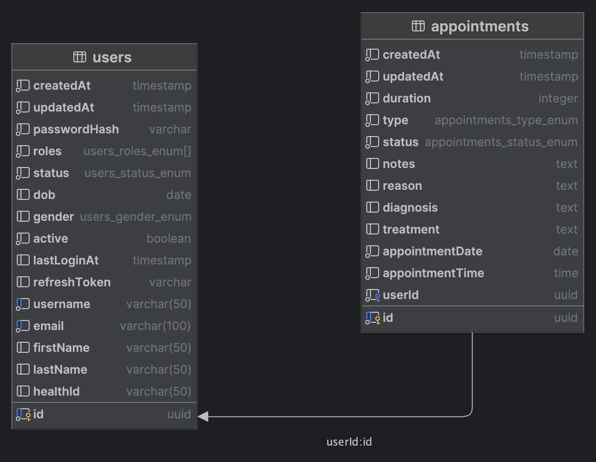

# Crea IAM Project

A RESTful Identity and Access Management (IAM) service built with NestJS, providing user management, authentication, and role-based access control.

## Features

- **User Management**: Create, read, update, and delete users
- **Authentication**: JWT-based authentication with access and refresh tokens
- **Role-Based Access Control**: Different permission levels (Admin, Doctor, Nurse, Patient)
- **Appointment Management**: Schedule and manage appointments

## Tech Stack

- **Framework**: NestJS
- **Database**: PostgreSQL
- **ORM**: TypeORM
- **Authentication**: JWT (JSON Web Tokens)
- **Testing**: Jest, Supertest, TestContainers
- **Containerization**: Docker and Docker Compose

## Getting Started

### Prerequisites

- Node.js (v20+)
- Docker and Docker Compose
- PostgreSQL (if running without Docker)

### Environment Setup

1. Clone the repository
2. Copy the sample environment file:
   ```bash
   cp .env.sample .env
   ```
3. Update the `.env` file with your configuration

### Running with Docker

```bash
# Start the application and database
docker-compose up -d

# To stop the application
docker-compose down
```

### Database Migrations

```bash
# Generate a new migration
docker compose exec iam-app npm run migration:generate --name=YourMigrationName

# Run migrations
docker compose exec iam-app npm run migration:run

# Revert the last migration
docker compose exec iam-app npm run migration:revert
```

## Testing

```bash
# Run tests
docker compose exec iam-app npm run test
```

# API Documentation
https://documenter.getpostman.com/view/28914499/2sB34kDyiX

## Project Structure

```
iam-project/
├── migrations/           # Database migrations
├── src/
│   ├── common/           # Shared utilities, decorators, guards
│   ├── config/           # Application configuration
│   ├── modules/          # Feature modules
│   │   ├── appointments/ # Appointment management
│   │   ├── auth/         # Authentication
│   │   └── users/        # User management
│   ├── app.module.ts     # Root application module
│   └── main.ts           # Application entry point
├── test/
│   ├── integration/      # Integration tests
│   └── unit/             # Unit tests
├── docker-compose.yml    # Docker configuration
└── README.md             # Project documentation
```

## Database Schema Definitions

### Users
- `id`: UUID (Primary Key)
- `username`: String (Unique)
- `email`: String (Unique)
- `passwordHash`: String
- `firstName`: String (Optional)
- `lastName`: String (Optional)
- `dob`: Date (Optional)
- `gender`: Enum (MALE, FEMALE, OTHER)
- `healthId`: String (Unique)
- `active`: Boolean
- `roles`: Array of Enum (ADMIN, DOCTOR, NURSE, PATIENT)
- `status`: Enum (ACTIVE, INACTIVE, SUSPENDED)
- `lastLoginAt`: Date (Optional)
- `refreshToken`: String (Optional)
- `createdAt`: Date
- `updatedAt`: Date

### Appointments
- `id`: UUID (Primary Key)
- `appointmentDate`: Date
- `appointmentTime`: String (HH:MM format)
- `duration`: Integer (minutes)
- `type`: Enum (CONSULTATION, CHECKUP, THERAPY, VACCINATION, FOLLOW_UP)
- `status`: Enum (SCHEDULED, CONFIRMED, IN_PROGRESS, COMPLETED, CANCELLED, NO_SHOW)
- `notes`: Text (Optional)
- `reason`: Text (Optional)
- `diagnosis`: Text (Optional)
- `treatment`: Text (Optional)
- `userId`: UUID (Foreign Key to Users)
- `createdAt`: Date
- `updatedAt`: Date

## ER Diagram

